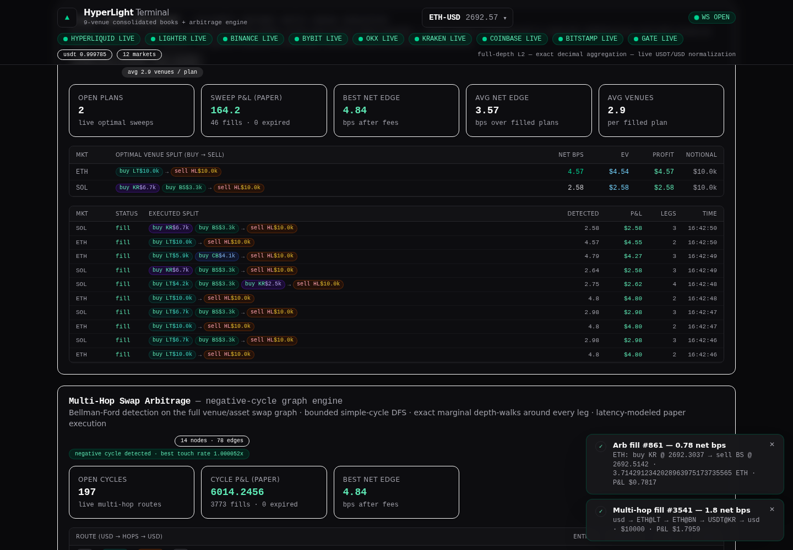
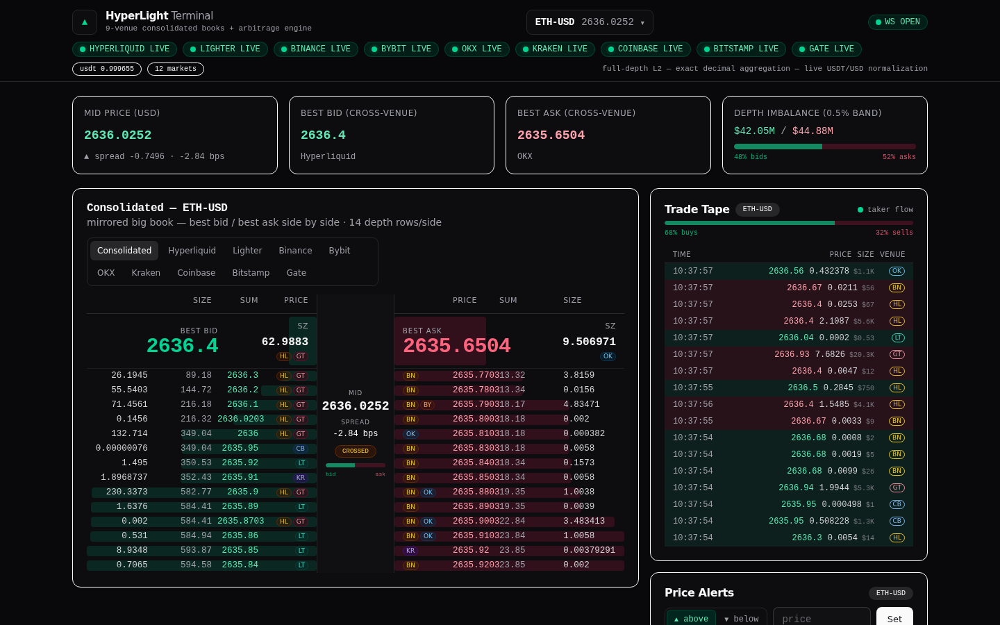
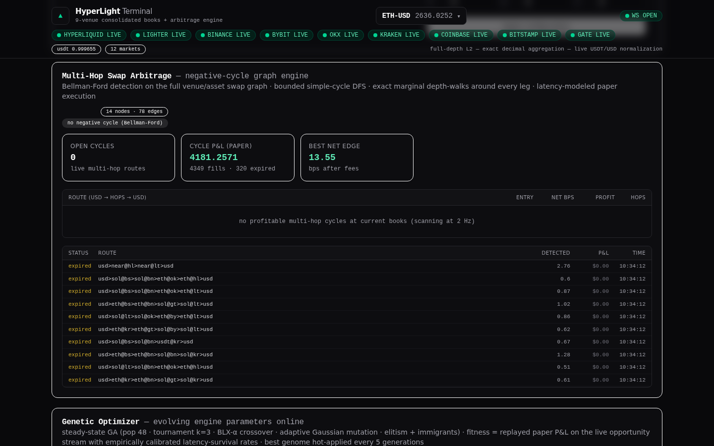
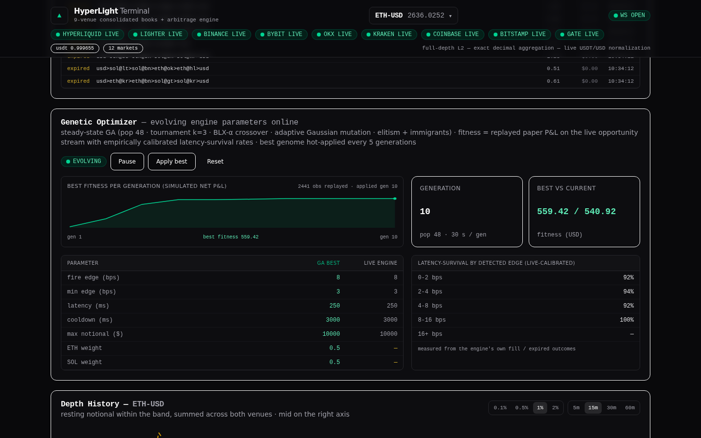
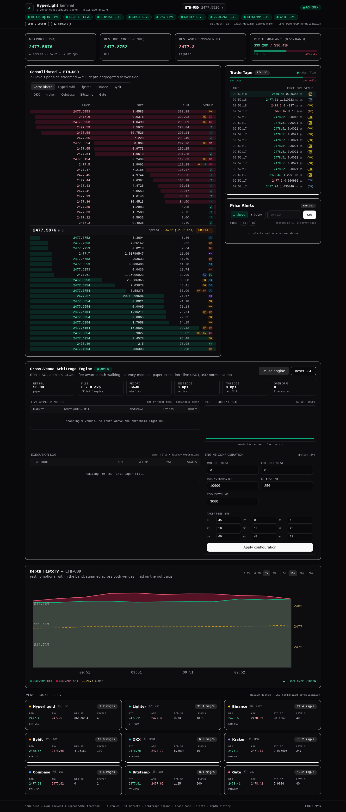
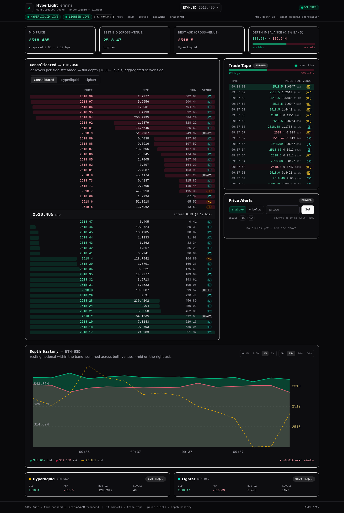

# HyperLight Terminal

[](https://www.rust-lang.org)
[](LICENSE)
[](https://render.com/deploy?repo=https://github.com/idrees2516/hyperlight)

A **real-time, 9-venue orderbook terminal + four-engine arbitrage system** that streams
live L2 market data for **Ethereum and Solana** from every major CLOB — Hyperliquid,
Lighter (zkLighter), Binance, Bybit, OKX, Kraken, Coinbase, Bitstamp and Gate — plus the
full 12-market perp universe on Hyperliquid/Lighter, consolidates everything into
USD-normalized aggregated books, and runs a stack of profit-optimizing arbitrage
engines — a 2-leg depth-walker, a **provably optimal global sweep optimizer**, a
multi-hop negative-cycle graph engine, and an online **genetic algorithm** that tunes
them all — with latency-modeled paper execution that fires **automatically** on every
positive-EV opportunity. Rendered in the browser — **100% Rust, end to end**.

- **Backend**: Rust + Axum + tokio + tokio-tungstenite (native-tls) + rust_decimal
- **Frontend**: Rust → WebAssembly via Leptos 0.8 (CSR, signals) + Tailwind CSS v4
- **Design system**: shadcn/ui (New York / zinc dark) — components implemented natively
  in Leptos, following shadcn's copy-paste-into-your-repo distribution philosophy
- **Precision**: every price/size is an exact `rust_decimal::Decimal` from feed to pixel —
  no floating point anywhere in the price path
- **Quote normalization**: USDT-quoted venues (Binance/Bybit/OKX/Gate) are converted to
  USD through the **live Kraken USDT/USD book mid**, so no phantom arb edge from quote basis

```
crates/
├── core/     # shared, wasm-safe types + N-venue aggregation + arb_walk +
│             # sweep optimizer + swap-graph cycle engine (all exact decimals)
├── server/   # Axum backend: 9 venue connectors, registry, coalescing publisher,
│             # trade tape, depth sampler, alert engine, 4 arbitrage engines,
│             # GA optimizer, Prometheus /metrics
└── ui/       # Leptos CSR frontend compiled to WASM by trunk
```

Deep documentation: [docs/ARCHITECTURE.md](docs/ARCHITECTURE.md) ·
[docs/ALGORITHMS.md](docs/ALGORITHMS.md) · [docs/DEPLOYMENT.md](docs/DEPLOYMENT.md) ·
[docs/API.md](docs/API.md)

## Screenshots

| | |
|---|---|
|  |  |
| *Global sweep optimizer — the exact optimal multi-venue execution plan with venue splits, EV gating and fills* | *Mirrored big book — BEST BID / BEST ASK giant side-by-side around a center seam (mid, spread, imbalance)* |
|  |  |
| *Multi-hop swap arbitrage — negative-cycle graph engine with route chains, fills + expirations* | *Genetic optimizer — fitness evolution, genome vs live engine, latency-survival calibration* |
|  |  |
| *2-leg arbitrage engine: opportunities, equity curve, execution log* | *Stats strip, trade tape, venue tabs* |

## The global sweep optimizer (flagship)

The 2-leg engine answers "what is the best single buy-venue / sell-venue pair?" The
**global sweep optimizer** answers the real question: **"what is the profit-maximizing
set of simultaneous taker orders across ALL venues?"** — and the answer is exact, not
heuristic:

1. Every venue's asks are merged into one curve keyed by **effective unit cost**
   `c = px · f · (1 + fee)` (USD, fee included); every venue's bids are merged into one
   curve keyed by **effective unit revenue** `r = px · f · (1 − fee)`.
2. The two curves are crossed greedily: repeatedly match
   `min(ask_depth, bid_depth)` units between the cheapest ask and the richest bid while
   `r > c`, capped by the deployed-notional budget.

Because each matched pair contributes exactly `q · (r − c)` of net profit (fees already
inside `r` and `c`), the matching condition *is* the profitability condition, and the
greedy exhausts **every positive marginal pair** — a provably optimal solution for
taker execution on piecewise-linear books. The output plan splits across as many venues
as depth requires (e.g. `buy 60% Bybit + 40% Gate → sell Hyperliquid`), coalesced into
per-(venue, side) legs with exact VWAPs, notionals and fees — an atomic order plan
ready for simultaneous submission.

3. **EV-gated firing**: an edge detected at X bps only converts to P&L if it survives
   the latency window. All three execution engines (2-leg, sweep, cycles) fire only when

   ```text
   profit_usd × P(survive | detected edge)  >  0.5 bps × deployed notional
   ```

   where the survival probability is **measured empirically** from the engines' own
   fill/expiry history, bucketed by detected edge (Beta-smoothed). Negative-EV fires are
   skipped so cooldown slots stay available for routes that actually pay.

The same EV gate, survival calibration and GA-tuned parameters are shared across all
engines — see [docs/ALGORITHMS.md](docs/ALGORITHMS.md) for the full derivation.

## The multi-hop swap arbitrage engine

The whole exchange universe is modeled as a **directed swap graph**: nodes are
assets (USD, USDT, one per market), edges are executable venue legs (a book
for market `M` quoted in `Q` contributes `Q → M` and `M → Q`; the Kraken
USDT/USD book contributes the FX legs, so USDT venues form genuine multi-hop
routes through an *explicit, spread-paying* conversion). Live topology:
**14 nodes / 78 edges**.

1. **Bellman-Ford negative-cycle detection** (log-space, fees inside every
   edge rate) runs at 2 Hz with a virtual source — if no negative cycle
   exists at touch rates, no profitable executable cycle can exist (deeper
   levels are strictly worse), so enumeration is skipped entirely.
2. **Bounded simple-cycle DFS** from USD enumerates every route up to 5 legs —
   e.g. `USD → ETH@Kraken → USDT@Binance → SOL@Bybit → USD`: buy ETH with
   USD, sell ETH into USDT, buy SOL with USDT, sell SOL back to USD.
3. **Exact marginal cycle walks**: `profit(x)` over a cycle is concave
   piecewise-linear, so the greedy advance while the cycle's marginal rate
   product `P(x) > 1` is exactly optimal — the multi-leg generalization of
   `arb_walk`. Reported entry, per-leg VWAPs, fees and profit are executable.
4. **Latency-modeled paper execution** identical to the 2-leg engine: fire,
   wait `latency_ms`, re-walk the live books, fill or expire. Every outcome
   feeds the GA's survival calibration.
5. Coverage is **the full 12-market universe** (not just ETH/SOL): any
   HL ↔ LT perp pair is a 2-leg cycle, and cross-market 4-leg routes through
   the USDT hub are found automatically.

## The genetic optimizer

A steady-state GA (population 48, tournament k=3, BLX-α crossover, adaptive
Gaussian mutation, elitism + random immigrants on stagnation) evolves the
engines' parameters online, one generation every 30 s:

- **Genome**: fire edge, listing edge, latency, cooldown, max notional, and
  per-market capital weights (Kelly-flavoured allocation).
- **Fitness**: replays the recorded stream of live observed opportunities
  (~1 Hz per route, 20 k window) through a fill simulator that uses the
  **empirically calibrated latency-survival curve** — measured from the
  engine's own filled/expired outcomes, bucketed by detected edge — so the
  optimizer learns the *actual* adverse selection of the venues, not a model.
- **Hot-apply**: every 5 generations, if the best genome beats the live
  parameters' fitness on the same window, it is applied to the running
  engines (2-leg + sweep + cycles) automatically; manual Apply / Pause /
  Reset from the UI or REST (`PUT /api/ga`).
- **Shared calibration**: the GA's measured survival curve is also the EV
  gate's input — the optimizer and the executors agree on what an edge is
  worth, so the system converges on parameters that maximize *realized*,
  not detected, profit.

## Deploy

The app is a single self-contained binary + static bundle that needs exactly one thing:
**outbound WebSocket access to 9 crypto exchanges**. Any always-on container host works.

| Platform | How |
|---|---|
| **Docker** (anywhere) | `docker build -t hyperlight . && docker run -p 3000:3000 hyperlight` — the [Dockerfile](Dockerfile) is a multi-stage build (Rust + trunk + tailwindcss), final image ~120 MB |
| **Render** (easiest) | Push this repo to GitHub → [render.com/deploy](https://render.com/deploy) or Dashboard → New → Blueprint → picks up [render.yaml](render.yaml) automatically. Health-checked, auto-deploy on push |
| **Railway** | Connect repo → it reads [railway.json](railway.json) → Dockerfile build, `/api/health` healthcheck |
| **Fly.io** | `fly launch --no-deploy && fly deploy` — [fly.toml](fly.toml) sets the `sin` region (close to Binance/Bybit/OKX engines), keeps one machine always on for the 9 feeds |
| **Vercel** | ⚠️ Vercel is serverless — it **cannot host** a long-lived WebSocket server that holds 9 exchange feeds. What you *can* do: host the `dist/` frontend on Vercel ([vercel.json](vercel.json) included) and point its `/ws` + `/api` rewrites at a Render/Fly/Railway backend, or change one line in `crates/ui/src/ws.rs` to point at the backend URL. The backend must be a container host |

### Runtime configuration (environment variables)

The paper executor boots **armed by default** — it automatically takes every
positive-EV opportunity the engines detect. Tune it per deployment without rebuilding:

| Variable | Default | Effect |
|---|---|---|
| `PORT` | `3000` | HTTP/WS listen port |
| `HYPAR_DISARMED` | `0` | `1`/`true` boots with the paper executor disarmed (tracking only) |
| `HYPAR_MIN_EDGE_BPS` | `3` | minimum net edge to list an opportunity |
| `HYPAR_FIRE_EDGE_BPS` | `8` | minimum net edge to fire (plus the EV gate) |
| `HYPAR_MAX_NOTIONAL_USD` | `10000` | capital cap per simulated fill |
| `HYPAR_LATENCY_MS` | `250` | simulated round-trip execution latency |
| `HYPAR_COOLDOWN_MS` | `3000` | per-route cooldown between fires |

### Production operations

- **Prometheus**: `GET /metrics` — venue up/state + message rates, USDT/USD, per-engine
  fills/expirations/P&L, GA generation, uptime (12 metric families).
- **Health**: `GET /api/health` — full venue/market/engine JSON for orchestrator probes.
- **Graceful shutdown**: SIGTERM **and** SIGINT are handled — in-flight WebSocket
  writes drain cleanly before exit (container-friendly).
- **Structured logs**: `RUST_LOG=info` (or `debug`) via `tracing`.

Full guide: [docs/DEPLOYMENT.md](docs/DEPLOYMENT.md).

Requirements for the Docker build: 2 GB RAM (release-mode rustc), ~10 min cold build.
The running server is light: ~80 MB RSS, ~10-40 msg/s per venue feed.

## Quick start

```bash
# build everything (backend + tailwind + trunk/WASM)
npm run build          # or: bash scripts/build-all.sh

# serve on :3000
npm run dev            # or: bash scripts/dev.sh

# verify
curl localhost:3000/api/health     # per-venue feed status for all 9 venues
curl "localhost:3000/api/book?market=sol"
curl "localhost:3000/api/tape?market=eth"
curl localhost:3000/api/arb         # 2-leg arbitrage engine state + config
curl localhost:3000/api/arb/config  # engine configuration (also PUT)
curl localhost:3000/api/sweep       # global sweep optimizer state
curl localhost:3000/api/cycles      # multi-hop cycle engine state
curl localhost:3000/api/ga          # genetic optimizer state (also PUT)
curl localhost:3000/metrics         # Prometheus exposition
curl "localhost:3000/api/history?market=eth"
curl -X POST localhost:3000/api/alerts \
  -H 'content-type: application/json' \
  -d '{"market":"sol","dir":"above","price":"200"}'
```

Requires: a recent Rust toolchain (rustup), `wasm32-unknown-unknown` target, `trunk`
(`cargo install trunk --locked`), and Node (only for the Tailwind CLI).

## What you see

| Panel | Description |
|---|---|
| **Stats strip** | Cross-venue mid price (with tick direction), best bid/ask across all 9 venues with venue attribution, depth imbalance meter over the ±0.5% band |
| **Big book** | Mirrored pro layout: giant **BEST BID** (emerald, left) and **BEST ASK** (rose, right) side by side around a center seam (mid, spread bps, imbalance meter); 14 depth rows/side with cumulative depth bars growing toward the seam, venue chips on consolidated levels; **crossed** marker when the cross-venue book is locked |
| **Venue tabs** | *Consolidated* (merged USD-normalized book, venue-tagged levels with per-venue chips) plus one native tab per live venue (prices as the venue quotes them) |
| **Market selector** | Dropdown over **12 markets** — ETH, BTC, SOL, DOGE, 1000PEPE, WIF, WLD, XRP, LINK, AVAX, NEAR, DOT — each showing a live mid + spread ticker (2 Hz) |
| **Trade tape** | Streaming taker-side trades from **all 9 venues** (HL/LT on all 12 markets, the seven CLOBs on ETH/SOL), newest first with side-colored flash animation, USD notional, venue badge and a buy-pressure meter |
| **Arbitrage engine (2-leg)** | Live cross-venue opportunities (executable VWAPs, notional, gross/fee/net bps, profit), paper equity curve, execution log with latency-expired attempts, and a live engine configuration (edges, notional cap, latency, cooldown, per-venue taker fees) |
| **Global sweep optimizer** | The exact profit-maximizing multi-venue plan per market: merged fee-adjusted executable curves from all 9 venues, greedy crossing that captures every positive marginal pair, venue-split legs (`buy BY $6.0k + buy GT $4.0k → sell HL`), survival-weighted EV, fill log |
| **Multi-hop swap engine** | The full venue/asset universe as a swap graph (14 nodes / 78 edges): Bellman-Ford negative-cycle detection at 2 Hz, bounded DFS cycle enumeration up to 5 legs, exact marginal depth-walks around every leg, route-chain table (`usd → ETH@Kraken → USDT@Binance → SOL@Bybit → usd`), latency-modeled paper fills + expirations |
| **Genetic optimizer** | Online parameter evolution (pop 48, 30 s/generation): fitness sparkline, best-vs-live genome table, empirically calibrated latency-survival rates, auto hot-apply of winning genomes, Pause/Apply/Reset controls |
| **Price alerts** | Server-side alert engine checked at 10 Hz against the cross-venue mid; above/below thresholds, quick ±1% fills, triggered log with fire time & price, toast notifications. Managed via WS commands or REST (`/api/alerts`) |
| **Depth history** | 60-minute rolling history sampled every 5 s: bid/ask resting notional within 0.1% / 0.5% / 1% / 2% bands (SVG areas + lines), mid-price overlay on the right axis, selectable 5m/15m/30m/60m windows |
| **Venue cards** | Per-venue best bid/ask, size, message rate, full-depth level count, quote currency |

## Architecture

```
Hyperliquid  Lighter   Binance  Bybit   OKX    Kraken   Coinbase  Bitstamp  Gate
 l2Book+     order_    depth20  order-  books5 book(100) ticker+    order_    spot.order
 trades      book+trd  +trades  book.50 +trades +trade   matches    +trades   _book+trd
 (12 mkts)   (12 mkts) (ETH,SOL)        (5 lvl) +USDT/USD (touch)             (20 lvl)
     │          │         │       │       │        │         │        │        │
     ▼          ▼         ▼       ▼       ▼        ▼         ▼        ▼        ▼
┌───────────────────────────────────────────────────────────────────────┐
│  ob-server (Axum)                                                      │
│  ├── connectors: parse → Decimal → VenueState (BTreeMap keyed by      │
│  │   12dp ticks) per (venue, market); snapshot-replace vs delta-       │
│  │   upsert; native-tls wsio.rs connector (AWS NLBs reject rustls     │
│  │   hellos); watchdogs + exp-backoff reconnects                      │
│  ├── registry: N-venue books + USD factors (live Kraken USDT/USD),    │
│  │   tape (dedup by venue trade id), depth history (5 s ring), alerts │
│  ├── arb engine: 10 Hz scan — ETH/SOL × venue pairs, exact marginal   │
│  │   depth-walk (fee + quote-factor aware), EV gate (survival-       │
│  │   calibrated), dust/cooldown guards, latency-modeled paper        │
│  │   execution (re-walk after latency_ms; expired if edge vanished), │
│  │   stats + equity curve + pair table                               │
│  ├── sweep engine: 2 Hz — merged executable curves from ALL venues,  │
│  │   greedy crossing = provably optimal multi-venue split plans      │
│  ├── cycle engine: 2 Hz — swap graph, Bellman-Ford negative-cycle    │
│  │   probe, bounded DFS enumeration, exact marginal cycle walks      │
│  ├── ga engine: 30 s generations — replays the recorded opportunity  │
│  │   stream, evolves engine parameters, hot-applies winners          │
│  ├── publisher: 10 Hz books (selected markets) + trades + alerts +    │
│  │   arb scans, 2 Hz tickers + engine updates, 0.5 Hz heartbeat      │
│  └── HTTP+WS: per-socket market routing (select), REST APIs,         │
│      Prometheus /metrics, SIGTERM-safe graceful shutdown             │
└───────────────────────────────────────────────────────────────────────┘
      │ WireEvent JSON (string decimals, pre-serialized once,
      │ routed by (kind, market) without re-parsing)
      ▼
┌───────────────────────────────────────────────────────────────────┐
│  ob-ui (Leptos 0.8, compiled to WASM)                              │
│  ├── ws.rs: auto-reconnecting client + select/alert/arb_config     │
│  ├── signals: books, tickers, tapes, histories, alerts, arb,       │
│  │   toasts — one reactive graph, no ad-hoc state                  │
│  ├── keyed For-rows: only changed levels re-render                │
│  └── components.rs: shadcn/ui set (Card, Badge, Button, Input,     │
│      MarketSelect, Toasts, Separator, Skeleton, StatTile, PulseDot)│
│      on Tailwind v4 tokens                                         │
└───────────────────────────────────────────────────────────────────┘
```

### Scaling model (why 12 markets stay light)

Every browser socket **selects one market**. The server serializes each event once and
tags it with `(kind, market)`; each socket forwards full-depth `book` frames only for its
selection, plus compact `ticker` frames (2 Hz, every market) and small `trades` batches.
Depth `history` is pushed per-socket for the selected market only (full window on switch,
5 s appends after). So per-client bandwidth stays ~constant as markets grow, and the
server never serializes a full book nobody is looking at.

## Protocol notes (live-verified)

**Hyperliquid** (`wss://api.hyperliquid.xyz/ws`)
- Subscribe `{"method":"subscribe","subscription":{"type":"l2Book","coin":"ETH"}}` and
  `{"method":"subscribe","subscription":{"type":"trades","coin":"ETH"}}`
- Book pushes `{"channel":"l2Book","data":{"coin","time","levels":[bids,asks]}}` —
  `levels` is a 2-tuple of arrays; each level is `{"px","sz","n"}` (string decimals);
  each push is a **full snapshot**
- Trade pushes `{"channel":"trades","data":[{"coin","side":"B|A","px","sz","time","tid"}]}`
  — `side` is the **taker** side, `time` is unix ms, `tid` is a unique id (dedup key)
- Heartbeat: client sends `{"method":"ping"}` → `{"channel":"pong"}`
- 1000PEPE is listed as **`kPEPE`**; perp universe verified via `POST /info {"type":"meta"}`

**Lighter** (`wss://mainnet.zklighter.elliot.ai/stream`)
- Server sends `{"type":"connected"}` first; only then subscribe
  `{"type":"subscribe","channel":"order_book/{idx}"}` and
  `{"type":"subscribe","channel":"trade/{idx}"}`
- Mainnet indices (live-verified via `GET /api/v1/orderBooks`):
  **0 ETH · 1 BTC · 2 SOL · 3 DOGE · 4 1000PEPE · 5 WIF · 6 WLD · 7 XRP · 8 LINK ·
  9 AVAX · 10 NEAR · 11 DOT** (217 active perps total on mainnet)
- `subscribed/order_book` → full snapshot; `update/order_book` → incremental deltas with
  upsert-by-price semantics, `size == 0` removes the level; levels are `{"price","size"}`
  string decimals; **no order count** is provided
- `update/trade` → `{"channel":"trade:{idx}","trades":[Trade],"liquidation_trades":[Trade]}`;
  `Trade = {trade_id, price, size, is_maker_ask, timestamp(ms), ...}`. Taker side:
  `is_maker_ask == true` → the taker **bought** (`"B"`)
- Server sends `{"type":"ping"}` → reply `{"type":"pong"}`
- REST market catalogue: `GET /api/v1/orderBooks`; public trade history:
  `GET /api/v1/recentTrades?market_id={idx}&limit={1..100}` (the sibling
  `/api/v1/trades` endpoint requires account auth)

### The seven CLOBs (live-verified)

| Venue | Endpoint | Book feed | Trade feed | Notes |
|---|---|---|---|---|
| **Binance** | `wss://stream.binance.com:9443/stream?streams=…` | `ethusdt@depth20@100ms` — full top-20 snapshot every 100 ms | `ethusdt@trade` | combined stream URL; `m` = buyer-is-maker |
| **Bybit** | `wss://stream.bybit.com/v5/public/spot` | `orderbook.50.ETHUSDT` — snapshot then deltas (size 0 removes; `u` counter gap ⇒ reconnect) | `publicTrade.ETHUSDT` | `S` is the taker side |
| **OKX** | `wss://ws.okx.com:8443/ws/v5/public` | `books5` — full top-5 snapshot ~100 ms; levels are 4-element `[px, sz, liq, n]` | `trades` | heartbeat is the raw text `ping`/`pong` |
| **Kraken** | `wss://ws.kraken.com/v2` | `book` (depth 100) — snapshot + upserts; numbers, not strings; `republish:true` ⇒ treat as snapshot | `trade` | also feeds the live **USDT/USD** conversion |
| **Coinbase** | `wss://ws-feed.exchange.coinbase.com` | `ticker` — best bid/ask + sizes (an exact 1-level book; `level2` now requires auth) | `matches` | `side` is the taker side |
| **Bitstamp** | `wss://ws.bitstamp.net` | `order_book_ethusd` — full snapshot ~5 Hz | `live_trades_ethusd` | `type: 0` = taker bought |
| **Gate** | `wss://api.gateio.ws/ws/v4/` | `spot.order_book` payload `[sym, "20", "100ms"]` — full 20-level snapshot; result keys are `bids`/`asks` | `spot.trades` (single object with `currency_pair`) | `spot.ping` heartbeat |

All connectors funnel into the same `VenueState` BTreeMap engine, with per-venue
reconnect backoff (halved after a clean disconnect) and, for Bybit, sequence-gap
detection that forces a resync.

### Browser ↔ backend socket protocol

Server → client (`WireEvent`): `book` (selected market), `ticker` (all, 2 Hz),
`trades` (batched), `history` (full window on select + 5 s appends), `alert_set`,
`alert_fired`, `arb_snapshot` (on connect / config change / reset), `arb_update`
(2 Hz live opportunities + scalar stats + equity point), `arb_fill_event` (every
paper fill or latency expiry), `sweep_snapshot` / `sweep_update` (2 Hz optimal
multi-venue plans + stats), `sweep_fill_event`, `cycle_snapshot` / `cycle_update` /
`cycle_fill_event` (multi-hop graph engine), `ga_update` (0.5 Hz optimizer state),
`status` (heartbeat with per-venue statuses + USDT rate).

Client → server:
- `{"type":"select","market":"doge"}` — switch this socket's market
- `{"type":"alert_create","market":"sol","dir":"above","price":"123.4"}`
- `{"type":"alert_delete","id":7}`
- `{"type":"arb_config","fire_edge_bps":"8","fees_bps":[["binance","10"],…]}` —
  partial engine config update (any subset of fields; applies to ALL engines)
- `{"type":"arb_reset"}` — reset paper-trading stats
- `{"type":"ga_toggle","enabled":false}` / `{"type":"ga_apply"}` / `{"type":"ga_reset"}` —
  genetic optimizer controls

## The arbitrage engine (2-leg)

The engine scans **ETH and SOL across all live venues** at 10 Hz — every ordered
venue pair (buy venue, sell venue) per market, 72 routes with 9 venues live:

1. **Exact marginal depth-walking** (`ob_core::arb_walk`): venue books are
   piecewise-linear, so the profit-maximizing executable size is found by walking
   the buy venue's asks and the sell venue's bids while
   `ask · f_buy · (1 + fee_buy) < bid · f_sell · (1 − fee_sell)` — fees and the
   live USDT/USD factors are inside the marginal comparison, so the reported
   size, VWAPs, notional and profit are *executable*, not touch-price fantasies.
2. **Quote-basis safety**: every comparison is USD-normalized through the live
   Kraken USDT/USD mid — ignoring it would inject ~2–3 bps of phantom edge on
   every USDT route.
3. **Latency-modeled paper execution**: when an opportunity crosses the fire
   threshold, the executor waits the configured `latency_ms`, then **re-walks the
   current books** — if the edge survived, it fills at the new (worse) prices; if
   it vanished, the attempt is logged as `expired`. This models adverse selection
   honestly instead of assuming you got the price you saw.
4. **Guards**: a $100 dust floor per route, per-route cooldown + single in-flight
   fill, and live-editable fee/edge/notional/latency/cooldown parameters (WS or
   `PUT /api/arb/config`).
5. **Telemetry**: win/loss record, fee drag, best/avg net edge, cumulative paper
   P&L with a 30-minute equity curve, per-route aggregates, and a fill log with
   both `filled` and `expired` outcomes.

The engine is a **signal + paper-execution engine** by design: placing real orders
needs API keys, nonce signing per venue and inventory/transfer management, which is
out of scope for a market-data terminal — but every number it shows is computed
exactly as a real executor would compute it.

## Engineering decisions

- **Exact decimals, fixed tick scale.** All levels are keyed as `Decimal` mantissas at a
  fixed 12-decimal scale inside `BTreeMap`s — lossless for real venue data, O(log n)
  best-bid/ask, and no float error ever reaches the UI. (Depth-history samples use f64
  — they feed a chart, not the trading ladder.)
- **Snapshot-vs-delta symmetry.** Hyperliquid's snapshot feed and Lighter's delta feed
  both land in the same `VenueState`; the consolidated book, spread/imbalance and depth
  stats are computed once server-side and shipped as display-ready strings.
- **Coalescing publisher + per-socket routing.** Lighter batches ~20–60 msgs/s per
  market across 12 markets; the backend marks markets dirty and publishes at most 10
  snapshots/s for markets someone is actually viewing, 2 Hz tickers for everything else —
  so browser DOM and network work is bounded regardless of venue message rates.
- **Trade dedup.** Both venues key trades by a venue-unique id (HL `tid`, Lighter
  `trade_id`) in a bounded set, so reconnects and re-subscribes never duplicate tape rows.
- **Keyed row diffing.** Ladder and tape rows are keyed by stable ids (venue trade id for
  the tape, full row content for the ladder), so Leptos only patches what changed —
  smooth 10 Hz updates without full re-renders.
- **Resilience.** Exponential-backoff reconnects, a 30s Lighter watchdog (CloudFront idle
  drops), lazy book creation for out-of-order snapshots, and per-venue health surfaced
  in the UI.
- **Why hand-rolled shadcn for Leptos?** shadcn/ui distributes components as source you
  own, not a runtime library. The canonical components are implemented natively in
  Leptos with the exact shadcn Tailwind tokens (`--color-background`, `border`, `muted`,
  `ring`, zinc-950 base), which guarantees compilation and pixel-level fidelity to the
  shadcn New York dark aesthetic.

## Files of interest

- `crates/core/src/lib.rs` — normalization, `VenueState`, N-venue `consolidate`,
  `compute_stats`, `arb_walk` (exact marginal depth-walking), arb wire types
- `crates/core/src/sweep.rs` — the global sweep optimizer (merged executable
  curves, greedy crossing, plan rendering) + sweep wire types
- `crates/core/src/cycle.rs` — swap graph, Bellman-Ford negative-cycle detection,
  bounded cycle enumeration, exact marginal cycle walks (+ unit tests)
- `crates/server/src/{hyperliquid,lighter,binance,bybit,okx,kraken,coinbase,bitstamp,gate}.rs`
  — the 9 venue connectors (books + trades, live-verified protocols)
- `crates/server/src/wsio.rs` — shared native-tls WebSocket connector
- `crates/server/src/state.rs` — registry, publisher, depth sampler, alert engine
- `crates/server/src/arb.rs` — the 2-leg arbitrage engine (scan, EV gate, fire,
  latency executor, stats)
- `crates/server/src/sweep.rs` — the global sweep engine (scan, EV gate, executor)
- `crates/server/src/cycles.rs` — the multi-hop cycle engine (scan, fire, executor)
- `crates/server/src/ga.rs` — the genetic optimizer (recorder, survival
  calibration, evolution loop, hot-apply)
- `crates/server/src/routes.rs` — `/ws` socket protocol, `/api/*` REST, `/metrics`,
  static serving
- `crates/ui/src/ladder.rs` — mirrored big book + depth bars + venue chips
- `crates/ui/src/arb.rs` — 2-leg arbitrage panel (opps, equity curve, fills, config)
- `crates/ui/src/sweep.rs` — global sweep panel (venue-split plans, EV, fills)
- `crates/ui/src/cycles.rs` — multi-hop panel (route chains, fills)
- `crates/ui/src/ga.rs` — genetic optimizer panel (sparkline, genome table)
- `crates/ui/src/{tape,alerts,chart,components}.rs` — tape, alerts, SVG depth
  history, shadcn/ui component set for Leptos
- `crates/ui/style.css` — Tailwind v4 theme with shadcn zinc dark tokens
- `scripts/test_e2e_v3.mjs` — full E2E: 9 venues, all four engines, /metrics,
  SIGTERM graceful shutdown
